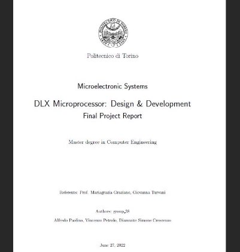



DLX Presentation

Microelectronic Systems 2021-2022

Alfredo Paolino, Vincenzo Petrolo, Diamante Simone Crescenzo

Outline

- VHDL Design
  - Datapath
  - Instruction memory
  - Data memory
  - Control Unit

•Simulation

- Synthesis
- Physical layout
- Technical report
- Possible improvements

VHDL Design

- Chosen approach: Bottom-up

` `

1 2 3

VHDL Design (cont.)

- And then we merged them

Datapath

- ALU : It is described, using a mixed behavioral-structural description in order to use the Pentium-4 adder in case of additions or subtractions.
- Register File : It is composed of 32 registers and has 2 read ports and 1 write port.
- Adders : Ripple carry adders used for computing next Program Counter.
- Multiplexers : Are used to choose between input sources in the Register File, Program Counter and ALU.
- Pipeline registers : Are used to store the results from previous stage.

Instruction Memory

- Size : 2 kB
- Word : 32 bits
- It contains the firmware that is  loaded into the microprocessor. 
- Asynchronous memory. 

Data memory

- Size : 2 kB
- Word size: 32 bits
- It stores data coming from registers. 
- Asynchronous memory. 

Control Unit

- LUT size : 62 lines
- Control Word: 9 bits
- Hardwired implementation 
- Modular control word generation  through **std\_logic\_vector** concatenation to improve  readability during debugging  phase. 

DLX PRESENTATION - MICROELECTRONIC SYSTEMS 21/22 7
Simulation – I-type tests

- In order to verify that  the instruction set for I- type instructions works, we wrote a simple assembly program that performs: 
  - Additions; 
  - Subtractions; 
  - Mask operations  through logical  instructions (i.e. AND/OR/XOR etc..). 

•Eventually the program  

halts. 

DLX PRESENTATION - MICROELECTRONIC SYSTEMS 21/22 8
Simulation – R-type tests

- In order to verify that  the instruction set for R- type instructions works,  we wrote a simple  assembly program that  performs: 
  - Additions; 
  - Subtractions; 
  - Shift operations. 

•Eventually the program  

halts. 

DLX PRESENTATION - MICROELECTRONIC SYSTEMS 21/22 9

Simulation – Iterative Division

- In conclusion, to create a  more complete program  we went through the  iterative division  simulation. 
- The algorithm is executed after a call to a procedure  (JAL) and performs 81/27. 
- When the procedure  ends it stores the result  into memory and load  again into another  register. Then it returns to  the caller. 

•Eventually the program  

halts. 

DLX PRESENTATION - MICROELECTRONIC SYSTEMS 21/22 11

Synthesis

- Starting from a clock  frequency of 50 MHz we  reached up to 1 GHz,  without major synthesis  optimizations. 
- Eventually 2 GHz clock  frequency goal was  achieved using aggressive  optimization flow with the  usage of **compile\_ultra,  set\_dont\_touch** to avoid  removal of skewing registers and **set\_max\_delay** to  constrain the quasi-critical  paths. 

Physical layout

- We followed the flow for the  place & route phase. 
- After the post-routing  optimization phase, we run a  static power analysis and got an  estimated power of **500 mW**  running at 1 GHz. 
- The total power estimated  from PrimeTime (1 GHz) was:  **426 mW **

Technical report

- The final step was to produce a report  describing more in detail what is shown in this  presentation. 

DLX PRESENTATION - MICROELECTRONIC SYSTEMS 21/22 14
Possible improvements

For a future PRO version, some of the possible improvements:

- Data Hazard Unit
- Branch Prediction Unit
- Floating Point Unit
- Instruction/Data cache
- Extended Instruction set
- Reducing to 1 the Branch delay slot
- Verification using UVM

DLX PRESENTATION - MICROELECTRONIC SYSTEMS 21/22 15

**Thanks for your attention!**
DLX PRESENTATION - MICROELECTRONIC SYSTEMS 21/22 16
